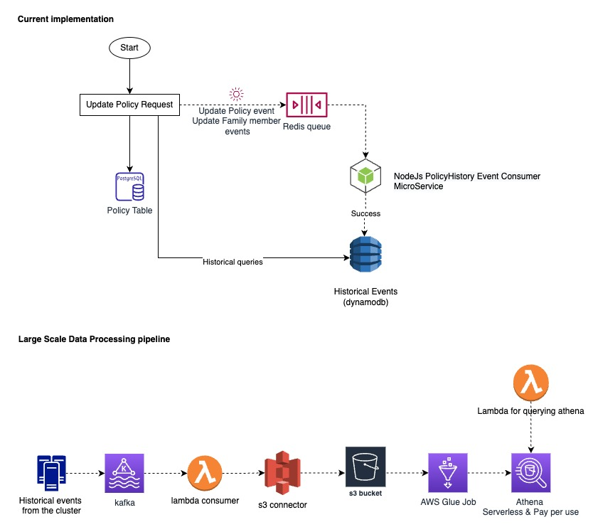

# Feather Take Home Assessment

Thank you for applying at Feather and taking the time to do this home assessment.

The goal of this project is to let you **show off your coding and problem-solving skills**, on a task that resembles the kind of work you’ll be doing with us.

This coding challenge applies to **frontend, backend, and full-stack roles**. Depending on the position you are applying for, you can focus on your specific area.

You can spend as little or as much time as you like on this project. We've added some initial boilerplate to help you get started, but **feel free to refactor every part of this app as you may seem fit**.

1. Start by reading the [Engineering challenge](#Engineering-challenge) for the position you've applied for and don't forget about the **Acceptance criteria** to have a clear idea of the requirements.
2. Use the [Getting started](#Getting-started) guide to set up a local version of the project on your machine.
3. Take a look at the [Data structure](#Data-structure) and [API](#API) to know what the data looks like.
4. Finish by answering a [couple of questions](#General-questions) about the project. You can answer them on this very same file.

## Engineering challenge

We've prepared several different user stories to work on. Depending on what position you applied to, pick one of them:

- [Backend](./backend-readme.md)
- [Frontend](./frontend-readme.md)
- [Full Stack](./full-stack-readme.md)

## Task requirements

- Make sure your feature **works as expected**
- Your code is **easy to understand** and follows best practices
- The project **runs with one command,** and without any external configuration
- **Your code has tests** to make sure the functionalities work as expected

## Getting started

1. Make sure you have [Docker](https://www.docker.com/products/docker-desktop/) installed on your machine
2. Set up the environment variables

```bash
cp ./.env.example ./.env
```

3. Build and run the Docker image:

```bash
cd backend
docker-compose build
docker-compose up
```

4. On a new terminal, run the migration and the seed script to add initial data:

```bash
cd backend
docker compose exec backend yarn prisma migrate dev
docker compose exec backend yarn prisma db seed
```

5. That’s it!

You can see the app on `http://localhost:3000`

The API should be running on `http://localhost:4000`

** Note **
If you want to install new dependencies, you'll have to do it inside the docker container. To do that, you can use the following command:

```
docker compose exec {backend OR frontend} yarn add {the_name_of_the_package}
```

Make sure to replace the values between the curly braces `{}` with the correct ones.

## API

After following the [Getting started](#Getting-started) guide, the backend should be running on port `4000`. The backend currently have one endpoint:

| Request type | Path        | Query Params | Example                   |
| ------------ | ----------- | ------------ | ------------------------- |
| `GET`        | `/policies` | `search`     | `/policies?search=BARMER` |

Feel free to update or add more endpoints to accommodate or improve your solution.

## Data structure

### Policy

| fields        | type                            | comment                                       |
| ------------- | ------------------------------- | --------------------------------------------- |
| id            | string                          | Used to identify the policy                   |
| customer      | [Customer](#Customer)           | Object holding the customer's informations    |
| provider      | string                          | Name of the provider (Allianz, AXA…)          |
| insuranceType | [InsuranceType](#InsuranceType) | Type of the insurance (Liability, Household…) |
| status        | [PolicyStatus](#PolicyStatus)   | Status of the insurance (Active, Cancelled)   |
| startDate     | date                            | Date when the policy should start             |
| endDate       | date                            | Date when the policy ends                     |
| createdAt     | date                            | Date when the record was created              |

### Customer

| fields      | type   | comment                       |
| ----------- | ------ | ----------------------------- |
| id          | uuid   | Used to identify the customer |
| firstName   | string | Customer’s first name         |
| lastName    | string | Customer’s last name          |
| dateOfBirth | date   | Customer’s date of birth      |

### InsuranceType

`InsuranceType` can be of `LIABILITY`, `HOUSEHOLD`, `HEALTH`

### PolicyStatus

`PolicyStatus` can be of `ACTIVE`, `PENDING`, `CANCELLED` and `DROPPED_OUT`

## General questions

- How much time did you spend working on the solution?
  I think around 24h or something. (spread across several days)
- What’s the part of the solution you are most proud of?

  - I implemented an event driven architecture for some extent. I've also attached a diagram. So proud of what i could do without restricting myself to a single solution.

  ### Thinking process

  1. Could've easily gone with a monolith but as the assignment had features like maintainin a history/snapshots, I had to come up with a different strategy.
  2. Saving the duplicate docs on a consistent database like postgress will be really slow and expensive.
  3. Could've used a debezium connector with kafka but then again the database has to do more processing which is not what we need
  4. So finally I had to use an eventually consistent masterless database like dynamodb to save histories.
  5. Then doing the same queries within the business logic doesn't make any sense so I moved the whole history logic to a different microservice.
  6. For the asynchronous communication, I've used redis. but i could've used a different data pipeline as I've mentioned in the architecture diagram.
     <br/>
     

- If you had more time, what other things you would like to do?

  1. Test Coverage, needs more API testing
  2. Plan the UI in a way to decouple the backend logic more
  3. Create a proper data pipeline using AWS (Kakfa, s3 connector, s3, gule, athena and lambda)
  4. Refactor more
  5. Replace redis with event bridge and make everything serverless
  6. Create CI/CD piplines and deploy
  7. Add cache layers to optimize the performance

- Do you have any feedback regarding this coding challenge?

  The Assignment is good because the thinking process can be expanded.

  _Is the initial setup working?, is something missing?, or any other comment_
  Yes it was working but littlebit tricky. The docker-compose didn't take the .env as specified by the path. So i had to execute the commands in the project root.

  1. https://stackoverflow.com/questions/64723235/docker-compose-environment-variables-blank-string

  2. needed to generate prisma client whenever I made a change to the schema

  3. Had to add persisant data storage using docker volumes, otherwise the data was lost.

\*\* Note - Commited the .env.example with the same value to .env as this is a test repo.
